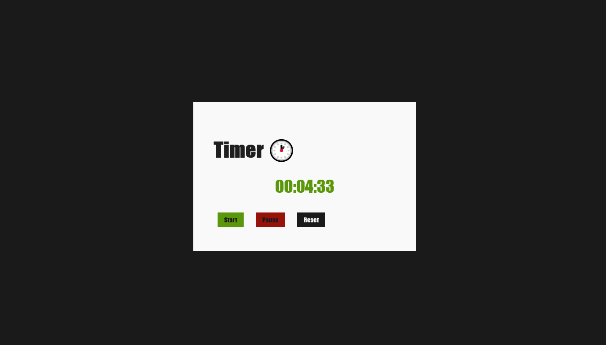

<h1 align=" center"> 
    Timer 🕐
</h1>

<h1>
    
</h1>

<h2 align="center">
    <a href="https://matheusnlourenco.github.io/project-pizzaria/">See the Project</a>
</h2>
<h2>🚨 about</h2>

Timer starting from 0 seconds to 23 hours, with start, pause and reset function.

<h2>🔨 Tools</h2>

- HTML
- CSS
- JAVASCRIPT